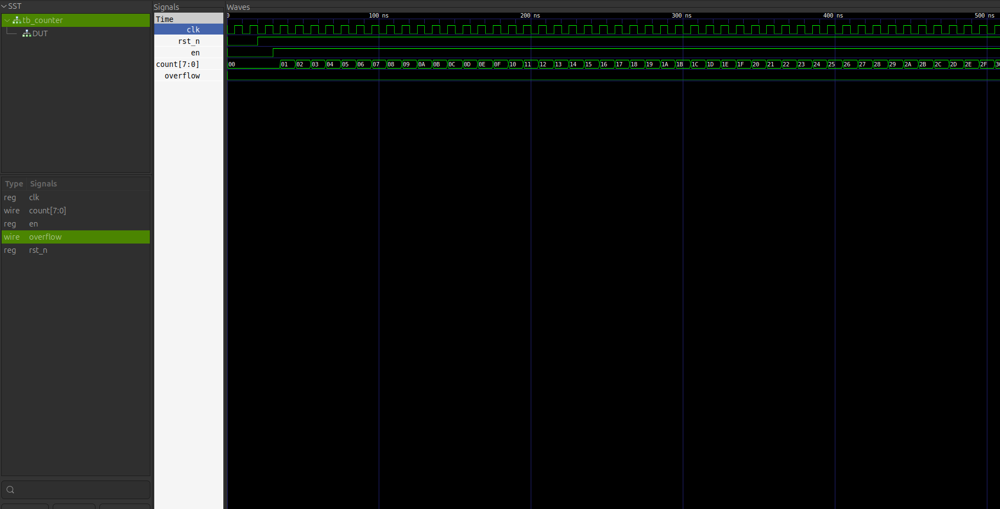

# Counter in Verilog

## Overview
A simple N=8 bit counter implemented in Verilog with a synchronous enable and a asynchronous reset, active on low.
It was built during my learning process of Verilog and RTL design.
Creating this counter also helped me understand the difference between blocking (=) and non-blocking (<=) assignments.

## Features
- Number of bits can be changed (default = 8 bits)
- There is a overflow flag output that forces the counter to reset

## Interface
| Port     | Direction | Width | Description         |
|----------|-----------|-------|---------------------|
| clk      | input     | 1     | Clock signal        |
| rst_n    | input     | 1     | Reset signal        |
| en       | input     | 1     | Enable signal       |
| count    | output    | 8     | Count Value         |
| overflow | output    | 1     | overflow flag       |

## Results

The waveform shows the counter behavior